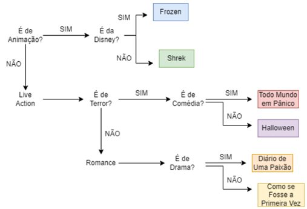

# 1. Sálario líquido

- Escreva um programa que peça ao usuário o valor da sua hora de trabalho, a quantidade de horas trabalhadas no mês e calcula a sua folha de pagamento.

- São descontados do salário o Imposto de Renda, que depende do salário bruto (conforme tabela abaixo), e o INSS, que corresponde a 10% do salário bruto.

- O FGTS corresponde a 11% do salário bruto, no entanto o FGTS não é descontado do salário, pois é a empresa que deposita.

- O salário líquido corresponde ao salário bruto menos os descontos.


Salário Bruto	               |   Imposto de Renda
------------------------------------------------------
Até R$900	                   |   Isento
Maior que R$900 até R$1500     |   Desconto de 5%
Maior que R$1500 até R$2500	   |   Desconto de 10%
Maior que R$2500               |   Desconto de 20%


**Observação**: as mensagens exibidas para o usuário deverão ser exatamente como apresentado abaixo (mensagens exibidas com os comandos input() e print()).

```
Exemplo de execução do programa:

Digite o valor da hora de trabalho: 16.0
Digite a quantidade de horas trabalhadas no mês: 160

Salário Bruto: R$ 2560.00

IR: R$ 512.00
INSS: R$ 256.00
FGTS: R$ 281.60

Total de descontos: R$ 768.00
```

---
# 2. Noite de cinema

Chandler e Mônica vão ao cinema no domingo à noite. Para deixar o encontro mais animado, eles decidem fazer um jogo de perguntas e respostas para escolher qual filme irão assistir.
Os seguintes filmes estão cartaz: Frozen, Shrek, Todo Mundo em Pânico, Halloween, Diário de uma Paixão, Como se Fosse a Primeira Vez.
E eles se categorizam como na figura :

- Elabore um programa que faça as perguntas como no diagrama, recebendo como entrada 1 (representando a resposta SIM) e 0 (representando a resposta NÃO) e então imprima o filme escolhido.

- Apenas faça as perguntas que sigam o fluxo do diagrama. 

**Dica**: você precisará criar inputs para as perguntas que surgirem ao longo do jogo, ou seja, não 
serão todos os inputs no início do programa.

---
# 3. Verificando triângulos

Crie um programa que solicite ao usuário três valores inteiros positivos, representando os lados de um triângulo.
Verifique se os valores formam um triângulo válido (a soma de dois lados deve ser sempre maior que o terceiro). 
Se os valores formarem um triângulo, classifique-o em:

- Equilátero: todos os lados são iguais.
- Isósceles: dois lados são iguais e um diferente.
- Escaleno: todos os lados são diferentes.

Se não formarem um triângulo, exiba a mensagem: "Os valores não formam um triângulo válido."
